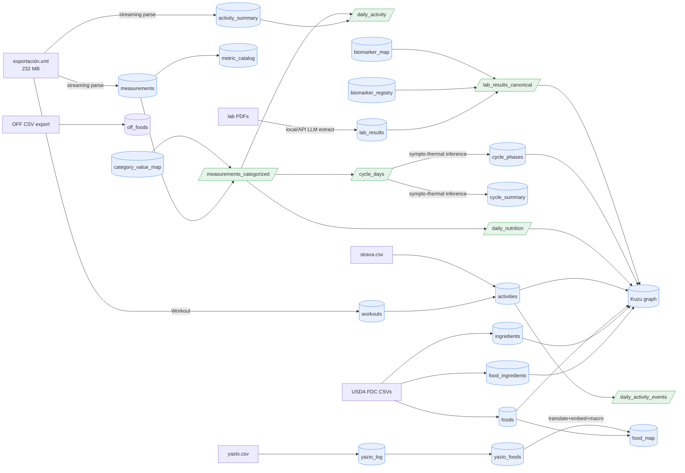

# Syncology Warehouse — Schema & Data Dictionary

The A1 warehouse is a single local DuckDB file (`data/clean/syncology.duckdb`,
gitignored). This document is the data dictionary for its tables, views, and the
derivation lineage between them. All counts below are aggregate row counts
(public-safe); no individual health values appear here.

## Conventions

- **Long/tidy core.** Health measurements live in one `measurements` table with
  the metric held as a *value* (`metric` column), not as a column or table name.
  A previously-unseen record type (e.g. the ones an Apple Watch will add) ingests
  with no schema change.
- **Identity & idempotency.** Each measurement's `row_key` is a hash of its
  natural key `(metric, source, start, end, value)`, used as the PRIMARY KEY.
  Re-running any loader inserts only genuinely new rows.
- **Day grain.** Marts bucket by *local* calendar date
  (`start_ts AT TIME ZONE 'Europe/Budapest'`), so a 23:00 reading lands on the
  correct day rather than rolling into the next UTC day. Instants are stored in
  UTC; the timezone is a build parameter.
- **Derived objects are rebuildable.** Views and the `cycle_phases` /
  `category_value_map` / `metric_catalog` tables are (re)built idempotently from
  `measurements` + `activity_summary`.

## Lineage



Rectangles with square brackets are base tables; parallelograms (slashes) are
SQL views. Module map: parser → `src/syncology/ingest/apple_health.py`;
normalization → `transform/category_values.py`; marts + phase inference →
`transform/marts.py`.

---

## Base tables

### `measurements` — the tidy measurement store (461,060 rows)

One row per unique health measurement across all sources.

| column | type | notes |
|---|---|---|
| `row_key` | VARCHAR **PK** | sha1 of `(metric, source, start, end, value)` — dedup + idempotency |
| `metric` | VARCHAR **NN** | HealthKit type with the `HK…TypeIdentifier` prefix stripped, e.g. `StepCount` |
| `record_kind` | VARCHAR | `Quantity` / `Category` / … (the stripped prefix) |
| `value_num` | DOUBLE | numeric measurements (460,863 rows) |
| `value_str` | VARCHAR | categorical enum strings (197 rows), normalized in the categorized view |
| `unit` | VARCHAR | e.g. `kcal`, `km`, `count`, `degC` |
| `start_ts` | TIMESTAMPTZ **NN** | UTC instant; local date derived at query time |
| `end_ts` | TIMESTAMPTZ | interval end for ranged samples |
| `creation_ts` | TIMESTAMPTZ | when the record was written by the source app |
| `source` | VARCHAR **NN** | `Veronika's iPhone`, `Yazio`, `Tempdrop`, `Slopes`, `Salud` |
| `source_version` | VARCHAR | app/OS version string |
| `correlation_id` | VARCHAR | groups records that belong to one logged event (e.g. a meal); 81,106 rows linked to 5,968 correlations |

Coverage: 2021-12-24 → 2026-06-24, 59 distinct metrics. Raw export had ~542k
`Record` elements; dedup to the natural key (Apple writes each Yazio nutrient
record both standalone and inside its meal `Correlation`) yields 461,060 unique
rows. See `docs/apple_health_ingestion_report.md` for the full story.

### `activity_summary` — Apple Activity rings (722 rows)

One row per day, keyed by `date_components` (a `YYYY-MM-DD` string, PK).
Columns: `active_energy(_goal/_unit)`, `move_time(_goal)`,
`exercise_time(_goal)`, `stand_hours(_goal)` — all DOUBLE except the unit.

### `category_value_map` — HealthKit enum → label + ordinal (22 rows)

Auditable entity-resolution table. PK `(metric, raw_value)`.

| column | type | notes |
|---|---|---|
| `metric` | VARCHAR **NN** | e.g. `MenstrualFlow`, `CervicalMucusQuality` |
| `raw_value` | VARCHAR **NN** | raw HealthKit enum, e.g. `HKCategoryValueVaginalBleedingMedium` |
| `label` | VARCHAR **NN** | clean label, e.g. `medium`, `egg_white`, `present` |
| `ordinal` | INTEGER | rank where the category is meaningfully ordered (flow intensity, mucus fertility signal); NULL for nominal / presence-only values |

### `cycle_phases` — inferred phase + fertility zone per day (601 rows)

Materialized from `cycle_days`. PK `day`.

| column | type | notes |
|---|---|---|
| `day` | DATE **PK** | local calendar date |
| `phase` | VARCHAR **NN** | clinical: `menstruation` / `follicular` / `ovulation` / `luteal` / `unknown` |
| `fertility_zone` | VARCHAR **NN** | STM zones: `infertile_pre` / `fertile` / `infertile_post` / `unknown` |
| `fertile_window` | BOOLEAN **NN** | shorthand for `fertility_zone = 'fertile'` |
| `cycle_day` | INTEGER | 1-based day within the current cycle, NULL outside a detected cycle |

**Method — sympto-thermal (STM), conservative with explicit `unknown`.**
Implements the established STM fertility-awareness rules, cross-checking the two
primary biomarkers. PMOS cycles are often long / irregular / anovulatory, so
nothing is fabricated — unconfirmed stretches stay `unknown`.

- **Temperature is the only confirmer of ovulation.** Coverline = the highest of
  the 6 low readings; need 3 readings above it, the **3rd ≥ 0.2 °C** above (the
  standard STM value). *Exception 1:* if the 3rd isn't a full 0.2, a **4th above
  the line** confirms. *Exception 2:* a reading dipping to/below the line voids
  that run (conservative). Ovulation = the last low day before the rise.
- **Mucus predicts.** Peak day (`csúcsnap`) = last peak-type mucus day (watery /
  egg-white); mucus confirms at **peak + 3**. Before ovulation, *any* mucus is
  fertile (change point = first mucus).
- **Cross-check:** confirmation day = the **later** of temperature-confirm and
  peak + 3 (temperature still required). Fertility zones follow: `infertile_pre`
  (menses → first mucus), `fertile` (first mucus → confirmation), `infertile_post`
  (after confirmation).

*Scope note:* STM's advanced early-infertile counting rules (−21-day, Döring −8,
5/3-day) are contraceptive-precision rules needing 6–12 logged cycles; they are
intentionally **not** implemented — `infertile_pre` is simply menses → first
mucus.

**Physiological guard.** The luteal phase runs to ~16 days at most, so a detected
shift implying a longer luteal is treated as a false-early shift
(common in long PMOS cycles): it is skipped and scanning continues for a
plausible later shift. If one is found the cycle is ovulatory with a realistic
luteal; if not it is `anovulatory` — either way `suspect_ovulation` records that
a shift was rejected.

On the real data (coverline margin 0.2 °C): **14/20 cycles ovulatory (70%)**, 6
cycles with a guard-rejected suspect shift, 23% `unknown`, and a clean biphasic
BBT signal (follicular ≈ 36.50 °C < luteal ≈ 36.83 °C — the guard *sharpens* this
by keeping follicular-temperature days out of luteal). Detection is stable across
0.15–0.30 °C, so the standard 0.2 needs no tuning; see
`scripts/sweep_ovulation_threshold.py`.

### `cycle_summary` — one row per cycle, with anomaly flags (20 rows)

Materialized from the same inference. PK `cycle_number`.

| column | type | notes |
|---|---|---|
| `cycle_number` | INTEGER **PK** | 1-based in observed order |
| `cycle_start` / `next_start` | DATE | menses onsets bounding the cycle |
| `cycle_length_days` | INTEGER | `start → next_start`; NULL for the censored last cycle |
| `ovulation_day` | DATE | last low day before the temperature rise (NULL if anovulatory) |
| `temp_confirm_day` | DATE | day the temperature run confirms (3rd/4th high) |
| `peak_day` | DATE | last peak-type mucus day (`csúcsnap`) |
| `confirmation_day` | DATE | cross-checked: `max(temp_confirm, peak + 3)` |
| `follicular_days` / `luteal_days` | INTEGER | phase lengths around a detected ovulation |
| `short_luteal` | BOOLEAN **NN** | luteal ≤ 10 days — the STM low-progesterone flag |
| `suspect_ovulation` | BOOLEAN **NN** | a thermal shift was detected but skipped by the >16-day-luteal guard |
| `cycle_length_z` / `luteal_length_z` | DOUBLE | z-score vs population norms |
| `cycle_length_flag` / `luteal_length_flag` | BOOLEAN | |z| > 2σ (NULL if length unknown) |
| `anovulatory` | BOOLEAN **NN** | no temperature-confirmed ovulation |

Norms (for z-scores): cycle length μ=29.30, σ=3.89 (n=1665); luteal length
μ=13.27, σ=2.67 (n=1514), from Fehring et al. (2012) menstrual-cycle-phase data.
On the real data 8/20 cycles flag — mostly **short luteals (5–7 d**, the
low-progesterone signal, now surfaced correctly because the guard rejects the
false-early shifts that previously masked them as long luteals) plus very long
cycles (up to 67 d, +9.7σ).

### `metric_catalog` — per-metric summary (59 rows)

Convenience rollup rebuilt each parse: `metric`, `record_kind`, `n_rows`,
`n_sources`, `first_ts`, `last_ts`, `units`.

---

## Views

### `measurements_categorized` (461,060 rows)

`measurements` LEFT JOINed to `category_value_map` on `(metric, value_str)`,
adding `value_label` and `value_ordinal`. Numeric rows pass through with both
NULL. All marts read from this view rather than raw `measurements`.

### `daily_activity` (1,643 days)

Per local day: `steps`, `distance_km`, `active_energy_kcal`,
`basal_energy_kcal`, `flights_climbed` (summed from `measurements`) FULL-OUTER
joined to `activity_summary` for `exercise_min`, `stand_hours`, `move_time`.

### `daily_nutrition` (262 days)

Per local day from the `Dietary*` metrics: `energy_kcal`, `protein_g`,
`carbs_g`, `fat_g`, `fiber_g`, `sugar_g`, and `meals_logged`
(`count(DISTINCT correlation_id)`). ~1 yr of Yazio coverage.

### `cycle_days` (601 days)

Per local day: `bbt_c` (avg BasalBodyTemperature), `flow_ordinal`,
`mucus_ordinal`, `intermenstrual_bleeding`, `lh_surge`. The raw signal layer that
feeds phase inference. ~1.8 yr of Tempdrop coverage.

---

## Labs layer

Blood-panel PDFs → structured biomarkers, then canonicalized across languages and
naming variants. Extraction runs locally (Ollama) or via the Anthropic API; see
`docs/` reports. Resolution is rule-based (a curated alias dictionary) with an LLM
resolver for comparison (write-up #1).

### `lab_results` — extracted biomarkers (755 rows)

One row per analyte per panel, names kept **as written** (Hungarian).

| column | type | notes |
|---|---|---|
| `row_key` | VARCHAR **PK** | hash of `(source_file, test, date)` — idempotent load |
| `panel_date` | DATE **NN** | authoritative date from the `lab_YYYYMMDD.pdf` filename |
| `source_file` | VARCHAR **NN** | source PDF |
| `test_name` | VARCHAR **NN** | analyte name as written, e.g. `Follikulus stimuláló hormon (FSH)` |
| `value_num` / `value_str` | DOUBLE / VARCHAR | numeric or qualitative result |
| `unit` | VARCHAR | e.g. `mIU/L`, `nmol/L` |
| `ref_low` / `ref_high` / `ref_text` | DOUBLE / DOUBLE / VARCHAR | reference interval |
| `flag` | VARCHAR | `H` / `L` if abnormal |
| `model` | VARCHAR | extracting model (provenance) |

Coverage 2021-09 → 2025-12, 22 panels, **148 distinct raw test names**.

### `biomarker_registry` — canonical vocabulary (84 rows)

`key` (**PK**, snake_case) · `name_en` · `category` (hematology / hormone / thyroid
/ lipid / liver / kidney / iron / vitamin / electrolyte / urinalysis / …) · `unit`
· `specimen` (`blood` / `urine`). The target vocabulary for resolution.

### `biomarker_map` — raw → canonical (148 rows)

`raw_name` (**PK**) → `canonical_key`, with the `method` (`exact` / `abbrev` /
`base` / `fuzzy` / `none`) and `score`. Handles the `(A)` lab-section suffix,
parenthetical abbreviations (`(FSH)`), HU↔EN synonyms, and **specimen
disambiguation by unit** (`Fehérvérsejt` at `/ltr(H)` → urine WBC vs
`Fehérvérsejtszám` at `Giga/L` → blood WBC).

### `lab_results_canonical` (view, 755 rows)

`lab_results` joined to its biomarker — every result tagged with `canonical_key`,
`biomarker` (EN name), `category`, `canonical_unit`. Makes a biomarker trendable
across panels regardless of how it was named (64 biomarkers have ≥3 dates).

### `biomarker_reference_ranges` — temporal reference intervals

A lab **revises its reference intervals over time** (new method / population), so
each biomarker's ranges form a timeline, not a single value. One row per
contiguous *era* (change-point segmentation of the observed panels — an interval
that recurs later gets its own era, so lab-to-lab flip-flops are handled):
`key` · `ref_low` · `ref_high` · `unit` · `n_panels` · `valid_from` · `valid_to`
(NULL = currently in effect). On the real data 5 biomarkers changed (SHBG
27.8→32.4→17.7; total testosterone narrowed 0.42–2.06 → 0.29–1.21; AMH, MCHC,
RBC). Use `resolve.reference_ranges.asof(key, date)` / `evaluate(key, date, value)`
to judge any result against the range **in effect on its date**.

### `lab_results_ranged` (view, 755 rows)

Each result joined to the range valid on its `panel_date`, with `asof_low` /
`asof_high` / `asof_status` (`low` / `normal` / `high`). 2 historical results
flip their in-range verdict versus the current range — the reason the timeline
matters.

---

## Activity layer

Discrete exercise events unified from Strava and Apple Health workouts — the
graph's `Activity` node source.

### `workouts` — Apple Health workout events (2 rows)

`row_key` (**PK**) · `workout_type` · `start_ts` / `end_ts` · `duration_s` ·
`source`. Currently the 2 Slopes ski sessions (no watch yet); distance/energy are
enriched from the in-window Slopes `measurements`.

### `activities` — unified activity events (147 rows)

| column | type | notes |
|---|---|---|
| `activity_id` | VARCHAR **PK** | `strava-<id>` or `apple-<hash>` |
| `source` | VARCHAR **NN** | `strava` / `apple_workout` |
| `activity_type` | VARCHAR **NN** | `run` / `ride` / `hike` / `ski` / … (Spanish Strava types mapped) |
| `name` | VARCHAR | activity title |
| `start_ts` / `end_ts` | TIMESTAMPTZ | |
| `duration_s` / `moving_s` | DOUBLE | |
| `distance_km` / `elevation_gain_m` | DOUBLE | |
| `avg_speed` / `max_speed` | DOUBLE | |
| `energy_kcal` | DOUBLE | ski sessions (from Slopes) |

145 Strava + 2 Apple, 2023-11 → 2026-06, 8 types. *Known limit:* a ski day logged
in both Slopes and Strava appears as two events (cross-source dedup not done).

### `daily_activity_events` (view)

Per local day: `n_activities`, `active_minutes`, `distance_km`, `activity_types`.
Complements `daily_activity` (which is step/energy telemetry) with discrete
sessions — so "what *kind* of training on this day" is answerable.

---

## Food & nutrition lookup

The canonical food/nutrient vocabulary (USDA FoodData Central), the logged Yazio
foods, and the cross-lingual reconciliation between them — the DB A5's voice
`log_meal` resolves free text against. Reconciliation method and the embedding-model
benchmark are in `docs/food_reconciliation_report.md`.

### `foods` — canonical USDA foods (13,692 rows)

Per-100g nutrition for SR-Legacy + Foundation + FNDDS survey foods (branded
excluded). `fdc_id` (**PK**) · `description` · `data_type` · `category` · plus
per-100g `energy_kcal`, `protein_g`, `carbs_g`, `fat_g`, `saturated_fat_g`,
`fiber_g`, `sugars_g`, `cholesterol_mg`, `sodium_mg`, `potassium_mg`, `calcium_mg`,
`iron_mg`, `magnesium_mg`, `vitamin_d_ug`, `vitamin_b12_ug`, `folate_ug`.

### `off_foods` — Open Food Facts second corpus (360,892 rows)

Branded/regional European product coverage that USDA lacks, for the retrieval
error tail (see `docs/food_reconciliation_report.md`). Products sold in Hungary /
Germany / Austria, from the public OFF CSV export. `off_code` (**PK**, barcode) ·
`description` (original-language product name) · `brands` · `categories` · per-100g
`energy_kcal` / `protein_g` / `fat_g` / `carbs_g` (nullable; 60% carry macros).
Deduplicated on (name, brand).

### `ingredients` — canonical ingredient vocabulary (2,332 rows)

`key` (**PK**) · `name` · `n_foods` (how many foods use it). Extracted from the
FNDDS recipe/input-food composition.

### `food_ingredients` — food → ingredient composition (18,584 rows)

`fdc_id` → `ingredient_key` (both FK-clean, 0 orphans) with `seq_num`,
`ingredient_name`, `gram_weight`. Populates the graph's
`Food-COMPOSED_OF→Ingredient`. 5,431 foods carry a composition (the FNDDS recipes);
**408 of the 597 reconciled** foods do.

### `yazio_log` — logged food entries (5,245 rows)

The Yazio CSV export, one row per logged item: `log_date`, `log_time`, `meal`,
`product`, `amount`, `unit`, `portions`, per-gram macros, and per-entry totals.

### `yazio_foods` — distinct logged products (875 rows)

`product` (**PK**) · per-100g `energy_kcal` / `protein_g` / `fat_g` / `carbs_g` ·
`times_logged`. The de-duplicated food vocabulary to reconcile.

### `food_map` — Yazio → USDA reconciliation (875 rows)

`product` (**PK**) → `fdc_id` (USDA match) with `en_name` (LLM translation),
`description`, `cosine`, `macro_sim`, `score`, `method`. Method
`translate+embed+macro`: translate HU/DE → EN (cheap LLM), embed against USDA
descriptions (local `bge-m3`), rerank the shortlist by macro fingerprint. The
embedder × query-transform × rerank comparison is write-up #2's subject.

---

## Knowledge graph (Kuzu)

The integration layer: a `Day` spine ties labs, cycle phase, nutrition, and
activity so one traversal answers cross-domain questions. Built from the DuckDB
marts via Parquet (`scripts/build_graph.py`).

**Nodes:** `Day` (date, phase, cycle_day, fertility_zone) · `CyclePhase` ·
`Biomarker` · `LabResult` (dated) · `ReferenceRange` (one per interval *era* per
biomarker, carrying `valid_from`/`valid_to` — an as-of `WHERE valid_from <= date
AND (valid_to IS NULL OR date <= valid_to)` finds the range in effect at any
time) · `Nutrient` (16 canonical nutrients with a `category` of energy / macro /
micro — one vocabulary shared by the logged macros and the USDA profiles) · `Food`
(canonical USDA food, 13.7k, per-100g macros) · `Ingredient` (2.3k, USDA) · `Meal`
(a Yazio eating occasion — a date + meal type, 844, with its logged macro totals) ·
`Symptom` (cycle signs — cervical mucus, LH test, flow, and **BBT**, the daily basal
temperature that confirms ovulation) · `Activity`.

*Meal ↔ Food — the reconciled link:* a `Meal` connects to its canonical USDA
`Food`s via `EATEN` (portion grams), sourced from the `food_map` reconciliation
(Yazio product → `fdc_id`). Traversing `Meal-EATEN→Food-HAS_NUTRIENT→Nutrient`
computes a nutrient that was never logged (e.g. daily magnesium) as `Σ grams/100 ×
per-100g`. This is the join the food-reconciliation benchmark exists to make.

**Edges:** `LabResult-MEASURED_AS→Biomarker`, `LabResult-RESULT_ON→Day`,
`ReferenceRange-REF_FOR→Biomarker`, `Day-IN_PHASE→CyclePhase`,
`Activity-PERFORMED_ON→Day`, `Day-INTAKE_ON→Nutrient` (logged macros, amount),
`Meal-LOGGED_ON→Day`, `Meal-CONTAINS→Nutrient` (logged macros, amount),
`Meal-EATEN→Food` (grams, portions — the reconciled link, 4.6k edges),
`Food-HAS_NUTRIENT→Nutrient` (per_100g — USDA profile, 208k edges),
`Food-COMPOSED_OF→Ingredient` (gram_weight, 18.6k edges),
`Symptom-OBSERVED_ON→Day` (value).

Example — hormone results by inferred cycle phase (Cypher):

```cypher
MATCH (b:Biomarker)<-[:MEASURED_AS]-(l:LabResult)-[:RESULT_ON]->(d:Day)-[:IN_PHASE]->(p:CyclePhase)
WHERE b.category = 'hormone'
RETURN p.name, count(*) ORDER BY count(*) DESC
```

---

## Example cross-domain queries

Average BBT by inferred cycle phase (the A1 definition-of-done query):

```sql
SELECT p.phase, count(d.bbt_c) AS n_days, round(avg(d.bbt_c), 3) AS avg_bbt_c
FROM cycle_phases p JOIN cycle_days d USING (day)
WHERE d.bbt_c IS NOT NULL
GROUP BY p.phase ORDER BY avg_bbt_c;
```

Protein intake on active vs. quiet days (nutrition × activity overlap ≈ 1 yr).
Note: without an Apple Watch the Activity `exercise_min`/`stand_hours` rings are
empty, so step count is the reliable activity proxy for now — the watch (≈ Aug
2026) will fill those rings through the same pipeline:

```sql
SELECT (a.steps >= 10000) AS active_day, round(avg(n.protein_g), 1) AS avg_protein_g
FROM daily_nutrition n JOIN daily_activity a USING (day)
WHERE n.protein_g IS NOT NULL AND a.steps IS NOT NULL
GROUP BY 1;
```

## Rebuild

```bash
uv run python scripts/parse_apple_health.py      # measurements + activity_summary + workouts + metric_catalog
uv run python scripts/normalize_categories.py    # category_value_map + measurements_categorized
uv run python scripts/build_marts.py             # daily_* + cycle_days + cycle_phases + cycle_summary
uv run python scripts/extract_labs.py            # lab_results (local or --engine api)
uv run python scripts/resolve_biomarkers.py      # biomarker_registry + biomarker_map + lab_results_canonical
uv run python scripts/build_activities.py        # activities + workouts → daily_activity_events
uv run python scripts/build_foods.py             # USDA foods + ingredients + composition
uv run python scripts/build_openfoodfacts.py     # OFF second corpus (off_foods; needs the CSV)
uv run python scripts/reconcile_foods.py         # Yazio → USDA reconciliation (food_map)
uv run python scripts/build_graph.py             # Kuzu knowledge graph + demo traversals
```
