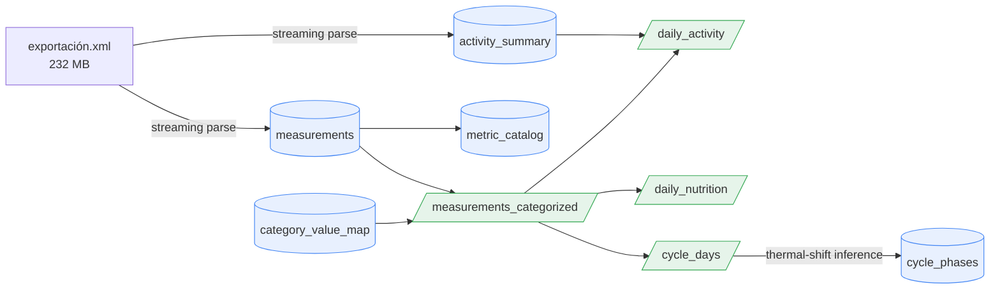

# Syncology Warehouse — Schema & Data Dictionary

The A1 warehouse is a single local DuckDB file (`data/clean/syncology.duckdb`,
gitignored). This document is the data dictionary for its tables, views, and the
derivation lineage between them. All counts below are aggregate row counts
(public-safe); no individual health values appear here.

## Conventions

- **Long/tidy core.** Health measurements live in one `measurements` table with
  the metric held as a *value* (`metric` column), not as a column or table name.
  A previously-unseen record type (e.g. the ones an Apple Watch will add) ingests
  with no schema change.
- **Identity & idempotency.** Each measurement's `row_key` is a hash of its
  natural key `(metric, source, start, end, value)`, used as the PRIMARY KEY.
  Re-running any loader inserts only genuinely new rows.
- **Day grain.** Marts bucket by *local* calendar date
  (`start_ts AT TIME ZONE 'Europe/Budapest'`), so a 23:00 reading lands on the
  correct day rather than rolling into the next UTC day. Instants are stored in
  UTC; the timezone is a build parameter.
- **Derived objects are rebuildable.** Views and the `cycle_phases` /
  `category_value_map` / `metric_catalog` tables are (re)built idempotently from
  `measurements` + `activity_summary`.

## Lineage



Rectangles with square brackets are base tables; parallelograms (slashes) are
SQL views. Module map: parser → `src/syncology/ingest/apple_health.py`;
normalization → `transform/category_values.py`; marts + phase inference →
`transform/marts.py`.

---

## Base tables

### `measurements` — the tidy measurement store (461,060 rows)

One row per unique health measurement across all sources.

| column | type | notes |
|---|---|---|
| `row_key` | VARCHAR **PK** | sha1 of `(metric, source, start, end, value)` — dedup + idempotency |
| `metric` | VARCHAR **NN** | HealthKit type with the `HK…TypeIdentifier` prefix stripped, e.g. `StepCount` |
| `record_kind` | VARCHAR | `Quantity` / `Category` / … (the stripped prefix) |
| `value_num` | DOUBLE | numeric measurements (460,863 rows) |
| `value_str` | VARCHAR | categorical enum strings (197 rows), normalized in the categorized view |
| `unit` | VARCHAR | e.g. `kcal`, `km`, `count`, `degC` |
| `start_ts` | TIMESTAMPTZ **NN** | UTC instant; local date derived at query time |
| `end_ts` | TIMESTAMPTZ | interval end for ranged samples |
| `creation_ts` | TIMESTAMPTZ | when the record was written by the source app |
| `source` | VARCHAR **NN** | `Veronika's iPhone`, `Yazio`, `Tempdrop`, `Slopes`, `Salud` |
| `source_version` | VARCHAR | app/OS version string |
| `correlation_id` | VARCHAR | groups records that belong to one logged event (e.g. a meal); 81,106 rows linked to 5,968 correlations |

Coverage: 2021-12-24 → 2026-06-24, 59 distinct metrics. Raw export had ~542k
`Record` elements; dedup to the natural key (Apple writes each Yazio nutrient
record both standalone and inside its meal `Correlation`) yields 461,060 unique
rows. See `docs/apple_health_ingestion_report.md` for the full story.

### `activity_summary` — Apple Activity rings (722 rows)

One row per day, keyed by `date_components` (a `YYYY-MM-DD` string, PK).
Columns: `active_energy(_goal/_unit)`, `move_time(_goal)`,
`exercise_time(_goal)`, `stand_hours(_goal)` — all DOUBLE except the unit.

### `category_value_map` — HealthKit enum → label + ordinal (22 rows)

Auditable entity-resolution table. PK `(metric, raw_value)`.

| column | type | notes |
|---|---|---|
| `metric` | VARCHAR **NN** | e.g. `MenstrualFlow`, `CervicalMucusQuality` |
| `raw_value` | VARCHAR **NN** | raw HealthKit enum, e.g. `HKCategoryValueVaginalBleedingMedium` |
| `label` | VARCHAR **NN** | clean label, e.g. `medium`, `egg_white`, `present` |
| `ordinal` | INTEGER | rank where the category is meaningfully ordered (flow intensity, mucus fertility signal); NULL for nominal / presence-only values |

### `cycle_phases` — inferred phase per day (601 rows)

Materialized from `cycle_days`. PK `day`.

| column | type | notes |
|---|---|---|
| `day` | DATE **PK** | local calendar date |
| `phase` | VARCHAR **NN** | `menstruation` / `follicular` / `ovulation` / `luteal` / `unknown` |
| `cycle_day` | INTEGER | 1-based day within the current cycle, NULL outside a detected cycle |
| `fertile_window` | BOOLEAN **NN** | peak mucus (egg-white), LH surge, or the days around a detected ovulation |

**Phase policy — conservative, with explicit `unknown`.** PMOS cycles are often
long / irregular / anovulatory, so this does *not* force a 4-phase label onto
every day. Ovulation is labeled only on a confirmed BBT thermal shift (the
sympto-thermal "3-over-6" rule); `follicular`/`luteal` are assigned only around a
detected ovulation; ambiguous or anovulatory stretches stay `unknown`. On the
real data this yields ~66% `unknown`, 5 ovulations over ~1.8 yrs, and a clean
biphasic BBT signal (follicular ≈ 36.48 °C < luteal ≈ 36.95 °C).

### `metric_catalog` — per-metric summary (59 rows)

Convenience rollup rebuilt each parse: `metric`, `record_kind`, `n_rows`,
`n_sources`, `first_ts`, `last_ts`, `units`.

---

## Views

### `measurements_categorized` (461,060 rows)

`measurements` LEFT JOINed to `category_value_map` on `(metric, value_str)`,
adding `value_label` and `value_ordinal`. Numeric rows pass through with both
NULL. All marts read from this view rather than raw `measurements`.

### `daily_activity` (1,643 days)

Per local day: `steps`, `distance_km`, `active_energy_kcal`,
`basal_energy_kcal`, `flights_climbed` (summed from `measurements`) FULL-OUTER
joined to `activity_summary` for `exercise_min`, `stand_hours`, `move_time`.

### `daily_nutrition` (262 days)

Per local day from the `Dietary*` metrics: `energy_kcal`, `protein_g`,
`carbs_g`, `fat_g`, `fiber_g`, `sugar_g`, and `meals_logged`
(`count(DISTINCT correlation_id)`). ~1 yr of Yazio coverage.

### `cycle_days` (601 days)

Per local day: `bbt_c` (avg BasalBodyTemperature), `flow_ordinal`,
`mucus_ordinal`, `intermenstrual_bleeding`, `lh_surge`. The raw signal layer that
feeds phase inference. ~1.8 yr of Tempdrop coverage.

---

## Example cross-domain queries

Average BBT by inferred cycle phase (the A1 definition-of-done query):

```sql
SELECT p.phase, count(d.bbt_c) AS n_days, round(avg(d.bbt_c), 3) AS avg_bbt_c
FROM cycle_phases p JOIN cycle_days d USING (day)
WHERE d.bbt_c IS NOT NULL
GROUP BY p.phase ORDER BY avg_bbt_c;
```

Protein intake on active vs. quiet days (nutrition × activity overlap ≈ 1 yr).
Note: without an Apple Watch the Activity `exercise_min`/`stand_hours` rings are
empty, so step count is the reliable activity proxy for now — the watch (≈ Aug
2026) will fill those rings through the same pipeline:

```sql
SELECT (a.steps >= 10000) AS active_day, round(avg(n.protein_g), 1) AS avg_protein_g
FROM daily_nutrition n JOIN daily_activity a USING (day)
WHERE n.protein_g IS NOT NULL AND a.steps IS NOT NULL
GROUP BY 1;
```

## Rebuild

```bash
uv run python scripts/parse_apple_health.py      # measurements + activity_summary + metric_catalog
uv run python scripts/normalize_categories.py    # category_value_map + measurements_categorized
uv run python scripts/build_marts.py             # daily_* + cycle_days + cycle_phases
```
