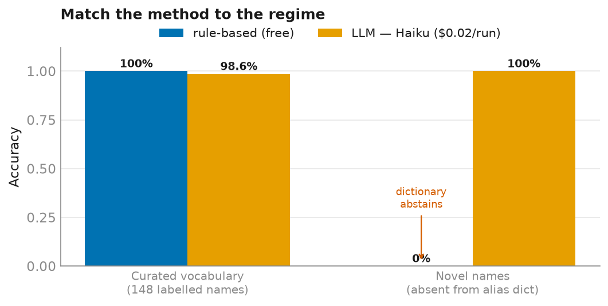

## Two resolvers, one honest question

The [food-retrieval study](writeup_food_retrieval.qmd) landed on a claim worth
testing everywhere: **match the method to the regime.** Food was open, cross-lingual,
and embedding-shaped — rules were useless. Biomarkers are the mirror image, and they
make the cleanest possible case for the *other* answer.

My lab reports are Hungarian PDFs. The same analyte is named a dozen ways — a
trailing `(A)` lab-section marker doubles most entries, abbreviations hide in
parentheses (`Follikulus stimuláló hormon (FSH)`), and a handful of names collide
across specimens: `Fehérvérsejt` at a `/ltr(H)` unit is *urine* white cells, while
`Fehérvérsejtszám` at `Giga/L` is *blood* white cells — same word, different biomarker.
Resolving 148 raw names to an **84-entry canonical registry** is entity linking on a
small, closed vocabulary.

So I built two resolvers and scored them against 148 hand-labelled names:

- a **rule-based** one — normalize (deaccent, strip the `(A)`, keep `#`/`%` tokens),
  match against a hand-written alias dictionary, disambiguate specimen by unit, fall
  back to fuzzy;
- an **LLM** one — Haiku, given only the canonical list and the raw `(name, unit)`
  pairs, asked to pick a key or abstain. One batched call. Values never leave the
  machine; only names and units are sent.

Critically, the alias dictionary is what a developer would *reasonably* write from
domain knowledge — not a copy of the gold labels. So rule-based recall is a real
measurement, not a lookup of the answer key.

## The result: rules win outright — on this regime



On the 148 labelled names the rule-based resolver scores **100%** — every name, zero
wrong, zero abstentions, at zero cost. The LLM scores **98.6%** and costs about two
cents a run. Not a big gap, but it's the *wrong sign* for the usual "just use the
model" instinct, and the two LLM errors are the most telling part:

```
Fehérje          → llm: total_protein   (gold: urine_protein)
Hemoglobin (VVT) → llm: hemoglobin      (gold: urine_hemoglobin)
```

Both are **specimen collisions** — exactly the blood-vs-urine clash the rule-based
resolver settles with a one-line unit guard (`/ltr` → the `urine_*` key). The LLM,
handed the same unit, still anchored on the more common blood analyte. When the
vocabulary is small enough to enumerate and the edge cases are known, an explicit,
auditable rule doesn't just tie the model — it beats it, for free, and you can
`SELECT * FROM` the reason for every decision.

## The other half of the truth: the novel-name ablation

A 100% rule-based score would be a suspicious place to stop. Rules are brittle by
construction — they only know the aliases you wrote. So I fed both resolvers names
*deliberately absent* from the dictionary:

| name | expected | rule-based | LLM |
|---|---|---|---|
| `Testosterone, total` (English) | testosterone_total | — abstains | ✓ |
| `Szérum kreatinin` (reordered HU) | creatinine | — abstains | ✓ |
| `Serum cholesterol` | cholesterol_total | — abstains | ✓ |
| `HbA1c` (not in registry) | *(none)* | — (correct) | — (correct) |

Here the ranking **flips completely**: the dictionary abstains on every unseen form,
while the LLM generalizes and gets all three — and both correctly abstain on the
analyte that genuinely isn't in the registry. This is the LLM's real value: not
beating the rules on the vocabulary you've curated, but covering the open tail you
haven't.

So the honest engineering conclusion is a *layering*, not a winner: **rules first for
the enumerable core (free, auditable, exact), the LLM as the fallback for names the
dictionary has never seen.** Which resolver is "better" is the wrong question; the
right one is which regime a given name is in.

## A bitemporal wrinkle: the reference range that moved

Resolving the *name* is only half of making a lab result meaningful — you also have
to judge the *value*, and that turned out to have a time dimension I didn't expect.

Labs revise their reference intervals (new assay, updated population norms). On my own
data, SHBG's printed normal range moved **27.8 → 32.4 → 17.7** across panels, and AMH's
shifted in 2023. The same measured value can therefore read "low" under one era and
"normal" under another — so a single "current" range silently mis-classifies the past.

The fix is bitemporal: segment each biomarker's history into contiguous **reigns** of a
reference interval (a new reign starts whenever the printed low/high changes), giving
each a `[valid_from, valid_to]`. Every result is then judged **as-of its own date** —
`83` reign-eras across the registry, `5` biomarkers with a genuine change. It's the
kind of correctness that never shows up in a demo and quietly matters for any longitudinal
health record.

## The takeaway

Biomarkers and foods are the same task — entity linking — in opposite regimes, and
they want opposite tools:

| | vocabulary | winner | why |
|---|---|---|---|
| **Biomarkers** | closed (84 keys) | **rules** (100% vs 98.6%, free) | enumerable; edge cases known; auditable |
| **Foods** | open, cross-lingual | **embeddings + translation** | no clean alias set; string match useless |

Reaching for the LLM first would have been *worse* on biomarkers — slower, paid, and
wrong on exactly the specimen edge cases a rule nails — yet it's the only thing that
covers the open tail. The meta-lesson holds across both write-ups: **diagnose the
regime before you pick the tool**, and don't be too proud to let a dictionary win.

---

*Method and aggregate metrics are public; individual lab values never appear and are
never sent to any model. Code: `resolve/biomarkers.py`, `resolve/llm.py`,
`resolve/reference_ranges.py`, `scripts/eval_resolvers.py`.*
