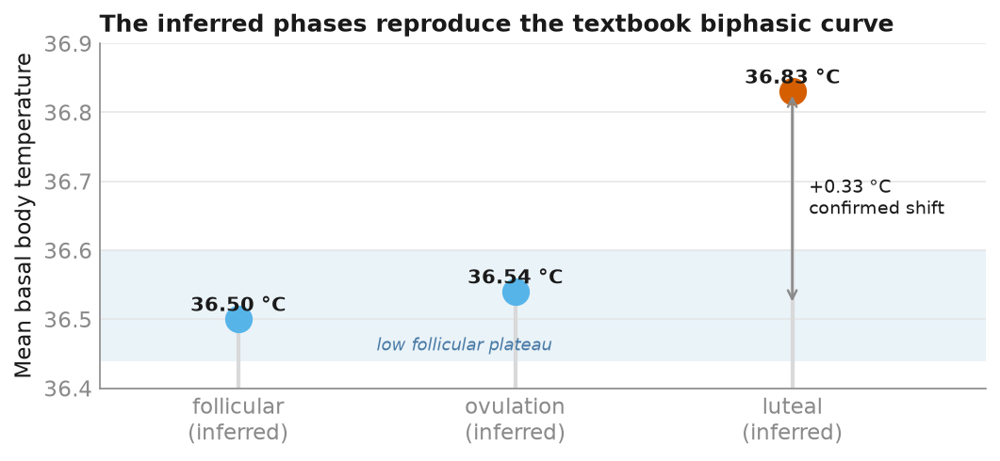

## The problem: a signal defined by its irregularity

Buried in ~4.5 years of Apple Health data is a menstrual-cycle record — basal body
temperature (BBT), cervical mucus, menstrual flow, ovulation tests. The goal is to
infer, day by day, where in the cycle each day sits, so nutrition and biomarkers can be
trended against phase. The complication is that I have **PMOS** (polycystic-ovary-type
irregularity): cycles are frequently long, irregular, or **anovulatory** — no ovulation
at all. The textbook four-phase cycle is exactly the wrong prior. A model that always
outputs a clean follicular → ovulation → luteal story would be *confidently wrong* most
of the time.

This turned into the most interesting modelling problem in the project — not because
the algorithm is fancy, but because getting it right meant being disciplined about
uncertainty.

## The method: sympto-thermal, done properly

The [sympto-thermal method](https://en.wikipedia.org/wiki/Symptothermal_method) (STM)
reads two hormones through two observable signs. Oestrogen thins cervical mucus and
**predicts** that ovulation is coming; progesterone (only present after ovulation)
**raises BBT** and thereby *confirms* it happened. So a real cycle shows two temperature
plateaus — a low follicular phase and a raised luteal phase — with the shift at
ovulation.

The core is a coverline rule (`_detect_temp_shift`):

- **Coverline** = the highest of the 6 low readings (no offset).
- Need **3 readings above** it; the 3rd must clear it by **≥ 0.2 °C**.
- *Exception 1* — a 4th reading above the line can confirm if the 3rd falls short.
- *Exception 2* — if any reading in the run dips back to the line, the run is void.

Mucus is the cross-check: confirmation is the **later** of the temperature shift and
"mucus peak + 3 days", because you're only certain once both signs agree. Ovulation-test
LH surges are treated as a hint only, never a confirmer — LH tests read positive
repeatedly under PCOS, so trusting them would manufacture ovulations that didn't happen.

Two things make this trustworthy rather than just plausible.

**It refuses to guess.** `follicular` and `luteal` are assigned *only* around a
confirmed ovulation; every ambiguous or anovulatory stretch stays **`unknown`**. For a
condition defined by irregularity, explicit "unknown" is the honest default — I'd rather
report less than fabricate structure.

**A physiological guard catches false shifts.** The luteal phase maxes out around 16
days. In a long cycle an early temperature blip can pass the 3-over-6 test and imply an
impossible 20–35-day "luteal". The guard rejects any shift whose implied luteal exceeds
16 days — but as a *skip-and-rescan*, not a plain reject: it keeps looking for the real,
later shift, and only calls the cycle anovulatory if none exists. Rejected detections
are flagged (`suspect_ovulation`), never silently dropped.

## The validation I trust most

You can't check inferred phases against a ground truth I don't have. But there's a
stronger test: does the inference reproduce the *phenomenon*? Average BBT by inferred
phase, and this falls out —

A clean **~0.33 °C biphasic shift** between the low follicular plateau and the raised
luteal phase. The inference labels days from the *rules*, not from the temperatures —
so the fact that the phase labels sort the temperatures into the two plateaus the
biology predicts is real evidence it's tracking signal, not noise.

## The moment the guard earned its place

The cycle model was rebuilt twice as better information arrived — a useful record of
letting ground truth override earlier guesses. The v1 rule was a crude flat threshold
(and a whole afternoon spent sweeping the 0.1–0.3 °C margin to pick it). Encoding the
*real* STM coverline rule made that tuning question **disappear**: under the correct
rule, detection is stable across 0.15–0.30 °C, so the standard 0.2 needs no tuning.

Then the 16-day guard did something better than reject. On the real data:

| | before guard | after guard |
|---|---|---|
| Ovulatory cycles | 15 / 20 | 14 / 20 |
| Luteal-phase days | 217 | **107** |
| Biphasic BBT gap | 0.19 °C | **0.32 °C** |

The impossible long "luteals" collapsed into their real short ones, which stopped
follicular-temperature days from polluting the luteal group — so the biphasic separation
*sharpened*. Better clinical accuracy, not just tidier tables. And a telling side effect:
turning on the guard broke three old test fixtures because they'd placed ovulation
unphysiologically early (a 28-day cycle ovulating on day 8). The fixtures were wrong; the
guard caught bad *test* data before it could wave through bad *real* data.

## What the data actually says

Across ~1.8 years of cycle logging (20 cycles): **14/20 ovulatory (70%)**, 6 with a
guard-rejected suspect shift, 8 flagged against population norms — and a majority of the
ovulatory cycles show **short luteal phases (≤ 10 days)**, the low-progesterone picture
consistent with PMOS. `cycle_summary` z-scores each cycle's length and luteal length
against published norms (Fehring et al. 2012), so a wall of "irregular" becomes something
diagnostic: *which* cycles are out of norm, and by how much.

That reframing is the point of the whole exercise. For a regular cycle, phase inference
is bookkeeping. For an irregular one, the anomalies *are* the clinically interesting
signal — and surfacing them honestly, with an explicit "unknown" wherever the data won't
support a call, is worth more than a prettier four-phase chart that isn't true.

## Lessons

1. **Let ground truth override earlier guesses.** The correct STM rule was both more
   accurate *and* made the tuning question dissolve.
2. **Validate against the phenomenon, not the exit code.** The biphasic curve emerging
   unprompted is the real proof.
3. **A physiological guard is a data-quality check.** The 16-day cap caught false shifts
   and unphysiological test fixtures alike.
4. **Flag, don't hide; and when unsure, say so.** Suspect detections and out-of-norm
   cycles are recorded, not dropped — and "unknown" is a valid, honest output.

---

*Method and aggregate results are public; individual measurements are not — row-level
examples in the source report are synthetic. Code: `transform/marts.py`,
`transform/category_values.py`, `scripts/build_marts.py`. Norms: Fehring et al. 2012,
cited, not copied.*
