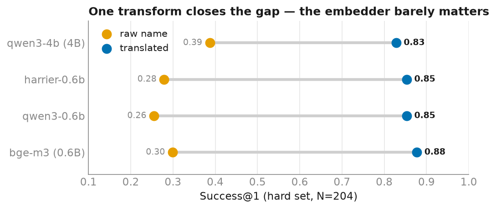
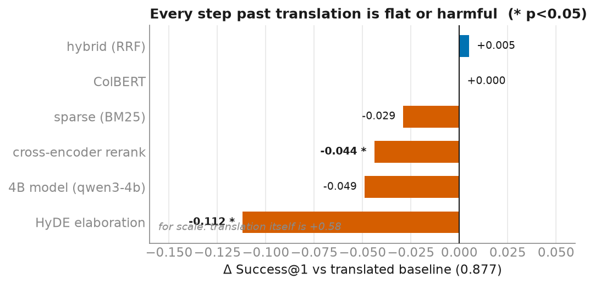
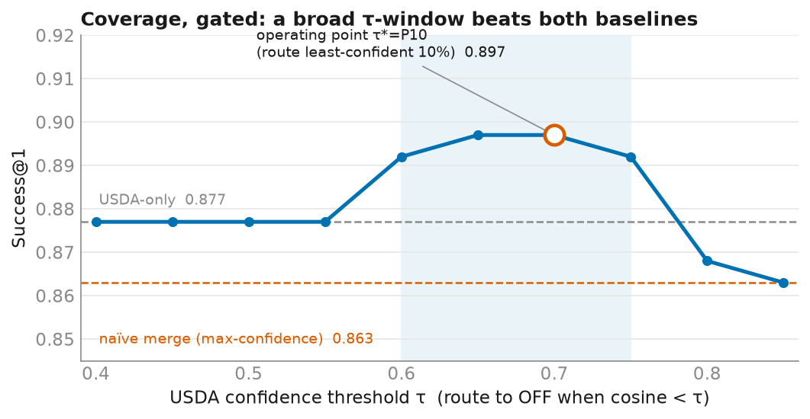
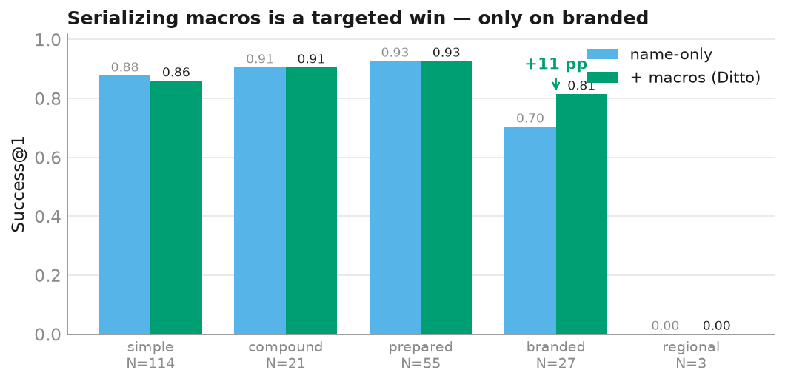

## The problem, and why it's a good one

I keep a food log. Four and a half years of it, in Hungarian and German, entered
into a phone app — `Uborka`, `Zabtej`, `Ajvár csípős`. To trend nutrition against a
reference and let a copilot answer "how much protein last week?", every one of those
**875 distinct logged foods** has to be resolved to a canonical entry in the
**13,692-food USDA FoodData Central** vocabulary.

This is textbook **cross-lingual entity linking**, and it is the *opposite* regime to
the other resolver in this project. Biomarkers (blood tests) are a small closed
vocabulary where a hand-written alias table hits 100% and the LLM adds nothing. Food
is open, cross-language, and full of near-duplicates — `Uborka` and `Cucumber` share
no characters, and USDA has a dozen "apple" rows, so "correct" is a *concept*, not one
row. Rules are useless here; learned embeddings are essential. That contrast is the
whole point: **match the method to the regime.**

The interesting question isn't "does it work" (it does — 88%). It's *which* of the
many things you could reach for actually earns its place. Domain retrieval is a hot
topic and the toolbox is deep — bigger embedders, rerankers, hybrid indexes, query
expansion, a second corpus. Most write-ups add all of them. I measured each one, with
confidence intervals and significance tests, and the answer was bracing: **almost
none of them help, and two of them significantly hurt.**

## Setup: the part that makes the rest trustworthy

- **Corpus**: 13,692 USDA foods (SR-Legacy + Foundation + FNDDS), embedded once.
- **Gold**: a **hard set of 204** logged foods, deep in the tail and **stratified by
  difficulty** — simple (`banana`), compound (`red apple`), prepared
  (`boiled beetroot`), branded (`Oatly Barista`), regional/OOV (`lecsó`). The
  stratification is what lets me see *where* the last 20% lives.
- **Metric**: this is concept-level *known-item* retrieval — one correct food,
  realized as a set of acceptable rows — so the honest metric is **Success@1** (plus
  Success@5, MRR, nDCG@10). I deliberately skip MAP / R-precision: they reward ranking
  *every* "apple" row high, which isn't the task.
- **Rigor**: every number carries a **bootstrap 95% CI**; every head-to-head is a
  **McNemar exact test** on paired outcomes. Without those, "0.83 vs 0.88" is a vibe,
  not a result.

All figures below are aggregate metrics. No personal measurements appear anywhere.

## Finding 1 — the one lever: translation

Embed the raw Hungarian/German name and retrieval is hopeless (Success@1 ≈ 0.25–0.39).
Translate it to a concise English name first — one ~$0.02 LLM pass — and every
embedder jumps to 0.83–0.88.

Two things in one picture. First, translation is worth **+58 points** — 120 of 204
queries flip from wrong to right, 2 the other way. Second, and less expected: once the
language gap is closed, **the embedder barely matters.** bge-m3 (0.6B, the oldest and
cheapest) sits at 0.88; Qwen3-4B — twenty times slower to embed — sits at 0.83, and the
gap isn't even significant (McNemar p = 0.064; every CI overlaps). Picking your model
off the MTEB leaderboard would point you at the big one. Here that's backwards.

## Finding 2 — everything past translation is flat or harmful

If translation is a lever, surely a stronger retriever is a second one? I held the
corpus and embedder fixed and varied only the sophistication, one axis at a time:
scale (Qwen3-4B), a cross-encoder reranker (`bge-reranker-v2-m3`), the retrieval
algorithm (sparse BM25, hybrid RRF fusion, bge-m3 ColBERT late-interaction), and
**HyDE** — replacing the query with an LLM-generated hypothetical food entry.

- **Reranking hurts** (−4.4 pp, p = 0.049). Food names are short; the bi-encoder
  already has the semantics, and the cross-encoder just adds noise — it breaks 13
  queries to fix 4.
- **The retrieval algorithm is a wash.** Hybrid RRF — the "always helps" default —
  buys +0.5 pp (p = 1.0). ColBERT's multi-vector machinery buys nothing at rank 1.
  (BM25 and ColBERT *do* lift nDCG@10, ranking more correct variants into the top-10 —
  but a correct row already sits at rank 1, so it doesn't show in Success@1.)
- **HyDE significantly backfires** (−11 pp, p = 3×10⁻⁵) — and not from bad generations.
  The hypothetical entries are clean ("*Carrot, raw — an orange root vegetable eaten
  fresh and crisp*"). That's exactly the problem: USDA descriptions are terse *identity*
  strings, so the extra descriptive tokens (`crisp`, `fresh`, `vegetable`) drift the
  embedding off the food's identity. Elaborating past the concise name is the
  query-side twin of the reranker's harm.

The pattern is consistent and contrarian: **spend on closing the language gap, not on
a bigger model, a reranker, a fancier index, or a richer query.**

## Finding 3 — coverage, behind a confidence gate

The stratified gold made one prediction falsifiable: the residual errors aren't a
*modelling* gap, they're a *coverage* gap. Regional foods absent from USDA — `lecsó`,
`ajvar` — score **0/3**, because the correct row simply isn't in the corpus. No
embedder or reranker can find what isn't there; only a second source can.

So I added **Open Food Facts** — 360,892 crowd-sourced products sold in Hungary /
Germany / Austria (chosen by provenance, not by peeking at the gold). It works: `ajvar`
and `lecsó` are recovered on *actual OFF rows*. But naively concatenating the two
corpora is the wrong move — 360k mostly-branded distractors dilute the clean USDA head,
and overall it's a wash (McNemar p = 0.70). Concatenation is really a *max-confidence*
router, and OFF's spuriously-high exact string matches (`apple` → OFF "apple") displace
correct USDA generics.

The fix is to route on **USDA confidence alone**: trust USDA's top-1 when its cosine is
high, fall back to OFF only when USDA is genuinely unsure.

Reported as a whole frontier, not one tuned number — a broad τ ∈ [0.60, 0.75]
dominates. At the label-free operating point (route the least-confident decile),
Success@1 is **0.897**, above both USDA-only (0.877) and the merge (0.863), and — the
point — **no stratum regresses**: regional recovers 0 → 0.67 while the head holds or
improves. Coverage is available; you just have to gate it.

## Finding 4 — the one sophistication that pays, and only locally

Branded products (`Oatly Barista`) were the standing soft spot: the translation drops
the brand, and the generic name that's left is ambiguous. This is precisely where
**Ditto** (Li et al. 2020) should help — serialize the record's structured attributes
into the text the model sees, so it can match on values, not just the name. Both
datasets carry per-100g macros, so I embed
`"oat milk (40 kcal, 1 g protein, 2 g fat, 7 g carbs per 100g)"` on both sides. (For
power, this runs on an enlarged, hand-adjudicated gold with the branded stratum grown
to N = 27.)

Overall it's flat (McNemar p = 1.0) — but the per-stratum split is the story. Branded
climbs **0.70 → 0.82 (+11 pp)**; the mechanism is clean — name-only anchors on the
wrong salient token (`ginger turmeric shot` → "Gelatin shot", `tofu, plain` → "French
toast, plain"), and the macros restore the concept (→ turmeric, → Tofu). It costs ~2 pp
on simple foods, where the name already suffices and the macros are noise; and it does
*nothing* for regional (0 → 0), which is coverage-bound, not attribute-bound. So it's a
scalpel, not a hammer — worth deploying **selectively**, on ambiguous/low-confidence
queries, exactly like the corpus cascade.

## Synthesis: the last 20% is a routing problem

Put the four findings together and the shape is clear. One transform does the heavy
lifting; every *global* elaboration is flat or harmful; and the remaining tail isn't
one bug with one fix — it's two different failures, each with its own targeted,
confidence-gated remedy.

| lever | effect | where |
|---|---|---|
| **Translation** | +58 pp | everywhere — the essential transform |
| Bigger model / reranker / hybrid / ColBERT / HyDE | 0 to −11 pp | nowhere — skip them |
| **Corpus coverage (OFF)**, behind a confidence cascade | regional 0 → 0.67, no head cost | the OOV tail |
| **Attribute serialization (Ditto)**, applied selectively | branded +11 pp | the ambiguous-name tail |

> **Translate always. Cover the vocabulary with a second corpus behind a confidence
> gate. Serialize attributes for the ambiguous-name tail. Reach for nothing else.**

The engineering lesson generalizes past food: for short-text cross-lingual entity
linking, the money is in *closing the language gap* and *covering the vocabulary* — not
in the bigger model or the fancier retriever the leaderboard would sell you. And the
last 20%, the part that separates a good product from a great one, is best framed not as
"a better model" but as **routing**: detect which failure mode you're in, and apply the
one narrow tool that fixes it.

---

*Method and aggregate metrics are public; the personal food log stays private. Full
benchmark harness, significance tests, and the figure code are in the project repo
(`scripts/eval_food_*.py`, `scripts/make_food_figures.py`). Grounding: BLINK
(Wu et al. 2020), Ditto (Li et al. 2020), HyDE (Gao et al. 2022), Qwen3-Embedding
(2025), bge-m3.*
